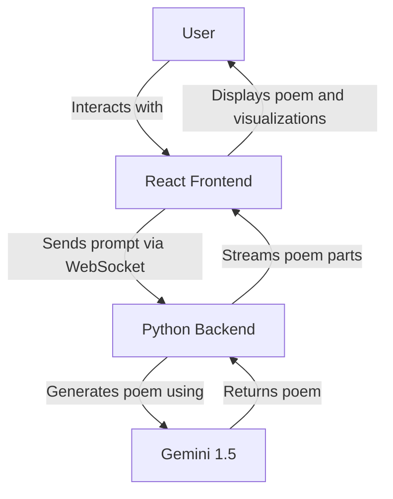

# Poem Generator App Documentation

## a. Breakdown of Milestones, Timeline, and Diagram

### Milestones and Timeline

**Project Setup**
- Set up React project
- Install necessary dependencies

**Backend Development**
- Implement WebSocket server
- Integrate Gemini 1.5 for poem generation

**Frontend Development**
- Create main WebSocketComponent
- Implement speech recognition
- Develop settings modal
- Design and implement UI

**Data Visualization**
- Implement D3.js for radar chart

**Testing and Refinement**
- Conduct thorough testing
- Refine UI and functionality

**Documentation and Deployment**
- Finalize documentation
- Prepare for deployment
- Github pages for frontend (Frontend URL: https://sarvesh788.github.io/AI-Poetry-Generation/ )
- Render for backend ( Backend URL: https://ai-poetry-generation-backend-new-tag.onrender.com/ )

### System Architecture Diagram

## b. Description of App Design and How the App Works

The Poem Generator App is a web application that allows users to generate poems based on prompts and customizable parameters. Here's how it works:

### User Interface
- The app presents a clean interface with an input field for prompts and a display area for generated poems.
- Users can enter prompts via text input or speech recognition.
- A settings modal allows users to adjust parameters like happiness, strength, length, rhyme, and grammar.

### Poem Generation
- When a user submits a prompt, it's sent to the backend via WebSocket.
- The backend uses Gemini 1.5 to generate a poem based on the prompt and parameters.
- The generated poem is streamed back to the frontend in parts.

### Display and Visualization
- Poem lines are displayed with a fade-in animation as they arrive.
- A radar chart visualizes the poem's parameters (happiness, terrifying, grammar, rhyming).

## c. Thought Process, Design Considerations, and Justification of Choices

### Real-time Interaction
- WebSockets were chosen for real-time, bidirectional communication between frontend and backend.
- This allows for streaming of poem parts, providing a more engaging user experience.

### Speech Recognition
- Implemented to make the app more accessible and user-friendly.
- Allows for hands-free input, which can be more natural for poetic inspiration.

### Customizable Parameters
- Gives users control over the poem's characteristics, enhancing engagement and personalization.
- Implemented as a modal to keep the main interface clean.

### Data Visualization
- D3.js was chosen for its powerful and flexible data visualization capabilities.
- The radar chart provides an intuitive representation of the poem's characteristics.

### React Hooks and Functional Components
- Used for better performance and easier state management.
- Allows for more modular and reusable code.

## d. Instructions on How to Run the App

1. Ensure you have Node.js and npm installed.
2. Clone the repository and navigate to the project directory.
3. Install dependencies: `npm install`
4. Start the development server: `npm start`
5. Ensure the Python backend is running on `ws://localhost:8765`

## e. List of Test Cases to Verify Functionality

- User can enter a prompt via text input and generate a poem.
- Speech recognition accurately captures user's spoken prompt.
- WebSocket connection is established and maintained.
- Poem parts are received and displayed correctly with animations.
- Settings modal opens, closes, and saves changes correctly.
- Radar chart updates accurately based on poem parameters.
- App handles WebSocket errors and disconnections gracefully.
- UI is responsive and works on different screen sizes.

## f. List of Potential Enhancements

- User accounts and saved poems feature.
- Multiple language support for prompts and generated poems.
- Option to share generated poems on social media.
- More advanced customization options (e.g., poetic forms, themes).
- Integration with text-to-speech to read out generated poems.
- Gallery of community-generated poems.
- Ability to edit and refine generated poems.

## g. Components for an "Enterprise Grade" App

- Authentication and Authorization system
- Scalable backend infrastructure (e.g., load balancing, containerization)
- Comprehensive logging and monitoring system
- Automated testing suite (unit, integration, end-to-end)
- CI/CD pipeline for automated deployments
- Data persistence layer (database) for storing user data and generated poems
- API versioning and documentation
- Performance optimization (caching, code splitting, lazy loading)
- Accessibility compliance (WCAG guidelines)
- Internationalization and localization support
- Enhanced security measures (e.g., rate limiting, input sanitization)
- Analytics and reporting features
- Customer support integration
- Service Level Agreement (SLA) management
- Disaster recovery and backup systems
